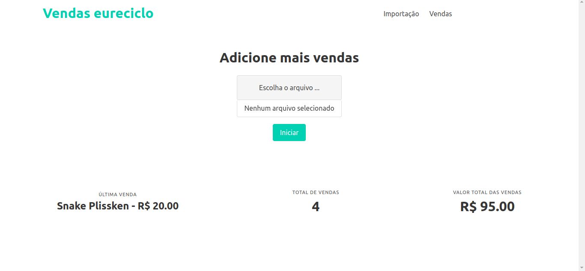
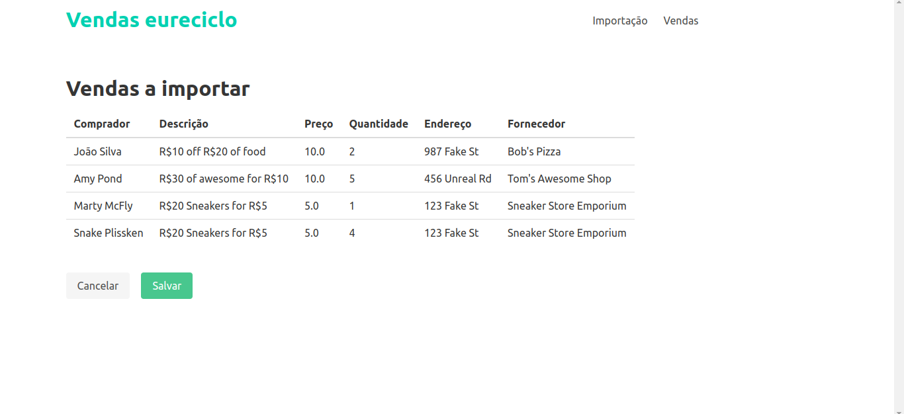
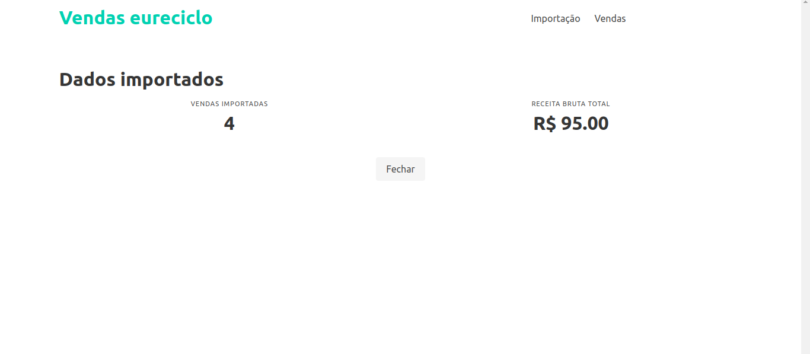
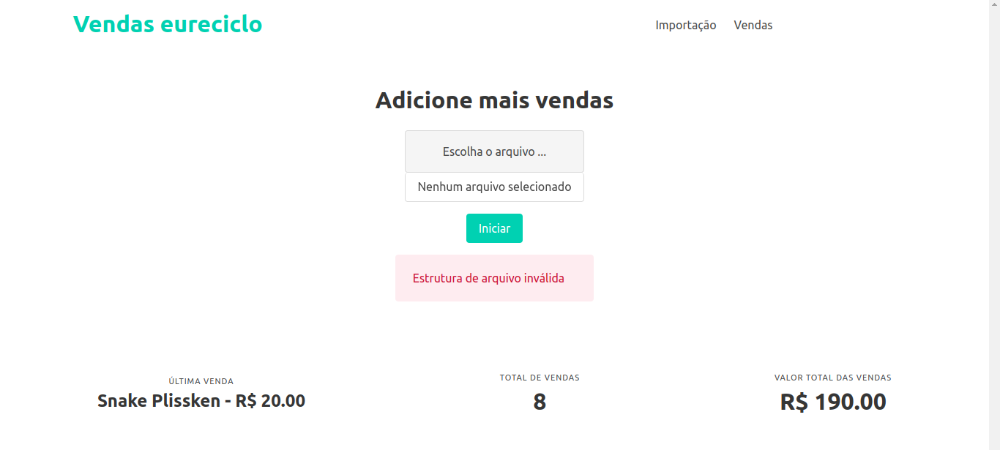

# desafio-eureciclo
- [Sobre](#sobre)
- [Tecnologias](#techs)
- [Preview](#preview)
- [Como usar](#como-usar)
- [Entre em contato](#contato)

<h2 id="sobre">Sobre</h2>
Desafio para a vaga de desenvolvedor backend Python na empresa eureciclo.
A aplicação consiste em receber um arquivo .txt com dados de vendas e importá-las 
para o banco de dados. A interface web deve fazer o upload do arquivo, listar e 
detalhar as vendas que estão cadastradas no sistema.

Foi um projeto interessante no qual eu gostei muito de ter desenvolvido.
Já trabalhei com Django profissionalmente (manutenção e melhoria), porém foram poucos 
projetos criados do zero até hoje, e sempre projetos simples.

A principal experiência que levarei deste projeto foi: aprender tanto do Django em um 
projeto que em teoria é simples, mas que ao aplicar boas práticas e estruturação correta 
se tornou uma aplicação mais complexa e desafiadora que testou bem os meus conhecimentos.

<h2 id="tech">Tecnologias</h2>
<div style="display: flex">
  
  
  
  
  
  
  
  
</div>

<h2 id="preview">Preview</h2>
Abaixo imagens do projeto:

### Página de importação
Página onde é feita a escolha do arquivo para importação das vendas.



### Página de processamento
Página onde é mostrado o resultado da importação e parsing do arquivo enviado.
O usuário pode confirmar as informações contidas no arquivo e decidir se vai
cancelar a importação ou salvar no banco de dados.



### Página de resultado do processamento
Mostra quantas vendas foram importadas e a receita bruta das vendas.



### Página de listagem de vendas
Mostra todas as vendas cadastradas no sistema.


### Página de detalhes de uma venda
Mostra os detalhes de uma venda.


### Aviso de erros
Quando acontece algum erro durante o processamento das vendas, a aplicação
volta para a página de importação e mostra um aviso na tela.



<h2 id="como-usar">Como usar</h2>

### Iniciar a aplicação

Para rodar a aplicação é preciso ter o Docker instalado e rodar o seguinte comando na pasta raiz do projeto:

```bash
./run-server.sh
```

Caso você precise fazer o _build_ da aplicação basta rodar o script passando a opção de build:

```bash
./run-server.sh build
```

### Testes

Para executar os testes basta rodar o seguinte comando:

```bash
  ./run-tests.sh
```

Caso você deseje saber a cobertura de testes da aplicação rode o script com a opção de _coverage_:

```bash
  ./run-tests.sh coverage
```

### Como criar uma venda

Para criar uma venda será necessário obter um arquivo com a estrutura de correta para que as vendas sejam importadas com sucesso. Um arquivo exemplo está presente em _docs/example.txt_.

Obtendo o arquivo com a estrutura correta, faça o upload do arquivo e clique em iniciar. 
Caso tudo ocorra como o esperado, a tela com as informações das vendas será mostrada e bastará 
clicar em _Salvar_ para que os dados sejam salvos no banco de dados. Logo após será possível 
ver um resumo da importação na página de resultados.

<h2 id="contato">Contato</h2>

Minha redes para contato:

<div style="display: flex">
  <a href="https://www.linkedin.com/in/wagner-cardoso-dev">
    
  </a>
  <a href="mailto:wagnerdev01@gmail.com">
    
  </a>
</div>